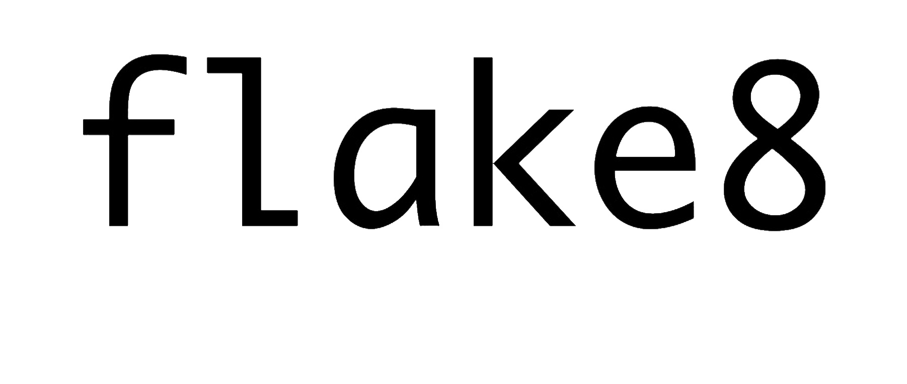

# Python Project Starter

This repo is a project template, improved from this [blogpost](https://sourcery.ai/blog/python-best-practices/), using [cookiecutter](https://github.com/audreyr/cookiecutter).

## Features

<p align="center">
    
    
    
    
    
    
    
</p>

- Testing with [pytest](https://docs.pytest.org/en/latest)
- Formatting with [black](https://github.com/psf/black)
- Import sorting with [isort](https://github.com/timothycrosley/isort)
- Static typing with [mypy](http://mypy-lang.org)
- Linting with [flake8](https://flake8.pycqa.org/en/latest)
- Git hooks that run all the above before committing with [pre-commit](https://pre-commit.com/)
- Virtual environment dependencies & PyPI publish [poetry](https://python-poetry.org/)

## Quickstart

```bash
# Get yourself cookiecutter
pip install --user cookiecutter

# Create your project from a template 
cookiecutter gh:GregoireHENRY/python-starter-template

# Or from local template
cookiecutter python-starter-template/
```

Voilà! ✨
You can see an example [here](https://github.com/GregoireHENRY/test-python-starter).
